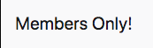
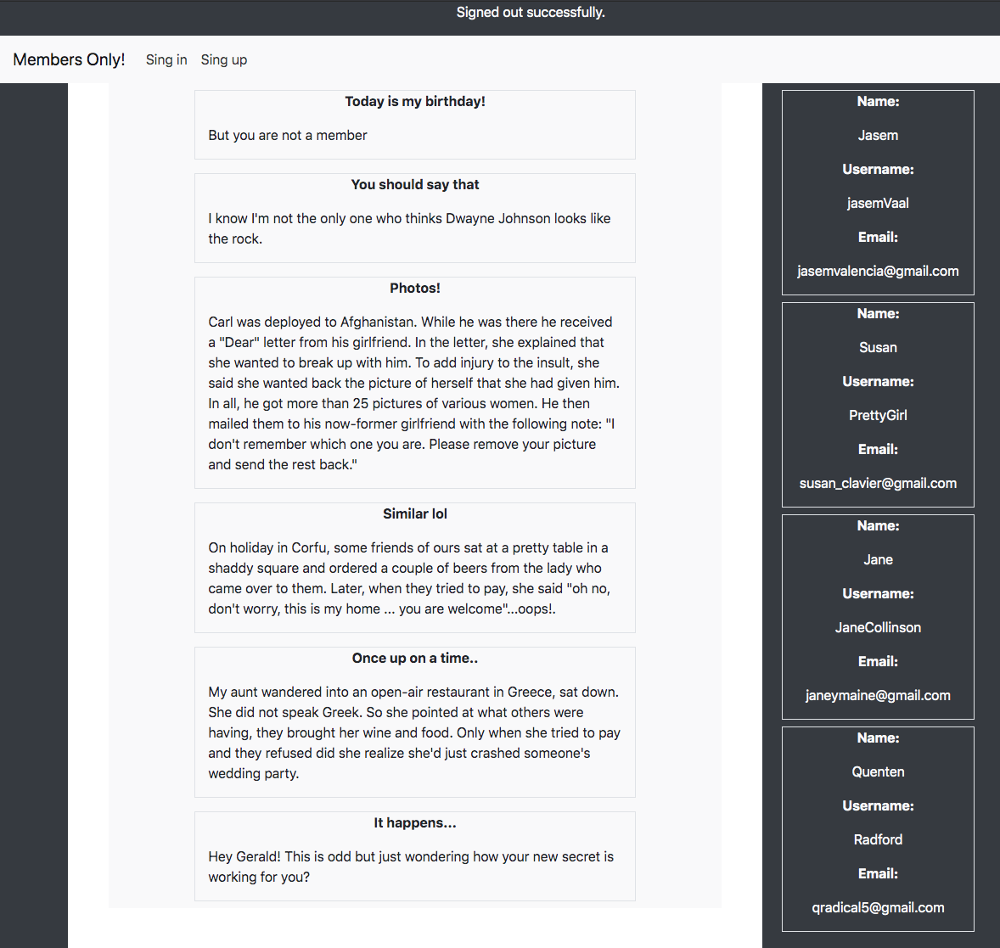
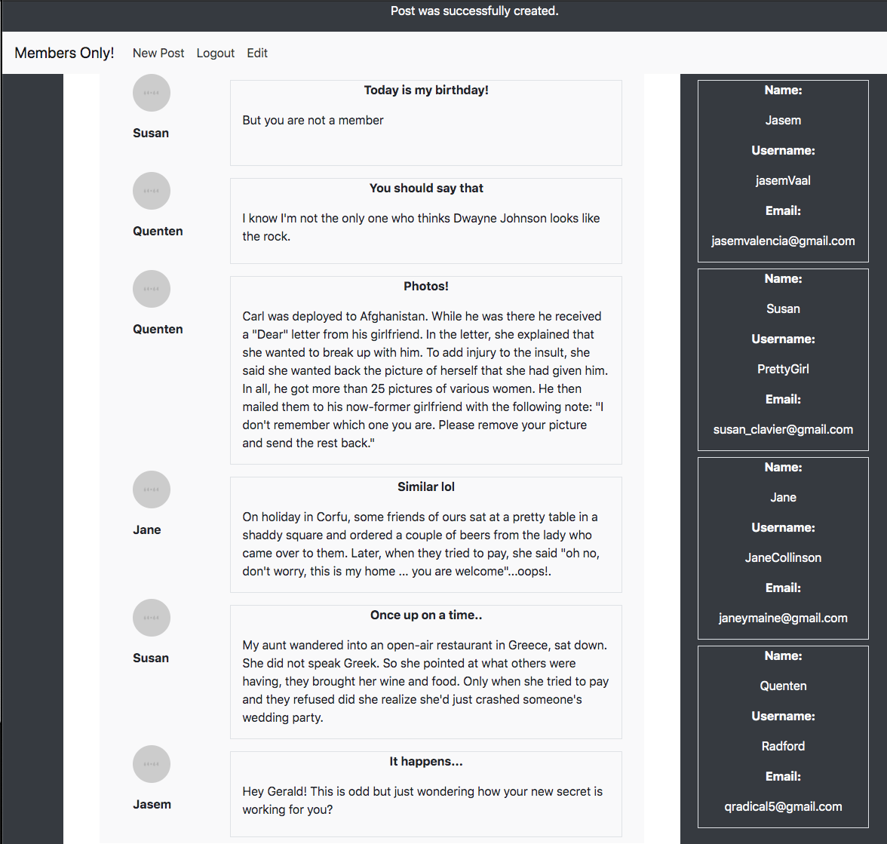

# Members Only! 🚀 

> In this project, we built an exclusive clubhouse, where members can write embarrassing posts about non-members. Inside the clubhouse, members can see who the author of a post is, but outside, they can only see the story and wonder who wrote it. 

## If you are not a member, you will see: 😑

## If you are a member, you will know everything: 😮  

## Getting Started
- Go to (https://github.com/JasemDuncan/members-only) and have a look around.
- Open your Terminal.
- Clone repo
- Go to the project's root
- Start server (rails server).
- In your browser open: http://localhost:3000/

## Built With

- Ruby on Rails

### Prerequisites

- Browser
- Internet

## Credit

- The Odin project (https://www.theodinproject.com/courses/ruby-on-rails/lessons/authentication)

## Authors

👤 **Pablo Alexis Zambrano Coral**

- Github: [@Alexoid1](https://github.com/Alexoid1)
- Twitter: [@pablo_acz](https://twitter.com/pablo_acz)
- Linkedin: [linkedin](https://www.linkedin.com/in/pablo-alexis-zambrano-coral-7a614a189/)

👤 **Jasem Duncan Valencia Vargas**

- Github: [@JasemDuncan](https://github.com/JasemDuncan)
- Twitter: [@JasemValencia](https://twitter.com/JasemValencia)
- Linkedin: [@Jasem-Duncan-Valencia](https://www.linkedin.com/in/jasem-duncan-valencia/)

## 🤝 Contributing

Contributions, issues and feature requests and any type of feedback to improve are welcome!

## Show your support

Give a ⭐️ if you like this project!

## 📝 License

This project has no license.
